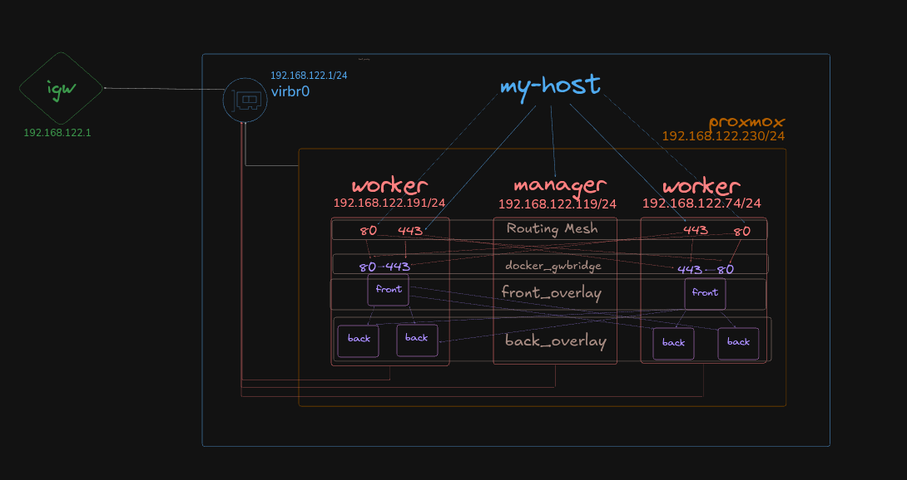

# proxmox-docker-swarm


---

## Create Infrastructure and Deploy Docker Swarm

### 1. Create Proxmox Environment
- Install Proxmox VE 9.0 (using the ISO installer)
- Create 3 virtual machines with Ubuntu 24.04.3:
    - 1 — manager node
    - 2 — worker nodes
- Set up SSH keys on all VMs for Ansible access
---
### 2. Deploy Docker Using Ansible
- Activate your virtual environment and install Ansible:
```bash
python3 -m venv .venv && source .venv/bin/activate
pip3 install ansible-core
```
- Run the playbook
```bash
cd ansible
ansible-playbook -i inventory/inventory.yml docker-swarm-playbook.yml
```
---
### 3. Initialize Docker Swarm
- After Docker installation is complete:
```bash
# On the manager node
docker swarm init
# This command will output a join token — use it to connect worker nodes
# On each worker node
docker swarm join --token <TOKEN> <MANAGER_IP>:2377
```
---
### 4. Build and Push Docker Images
```bash
# Build frontend image
cd apps/frontend
docker build -t sweaty1111/sky_service_frontend:0.0.1 .
docker push sweaty1111/sky_service_frontend:0.0.1

# Build backend image
cd ..apps/backend
docker build -t sweaty1111/sky_service_backend:0.0.1 .
docker push sweaty1111/sky_service_backend:0.0.1
```
---
### 5. Deploy Docker Stack
```bash
# Copy the stack file to the manager node
scp docker-stack.yml artem@192.168.122.119:/home/artem

# Connect to the manager node and deploy the stack
docker stack deploy -c docker-stack.yml sky

# Check running services
docker service ls

# View which nodes are running which tasks
docker stack ps sky
```


